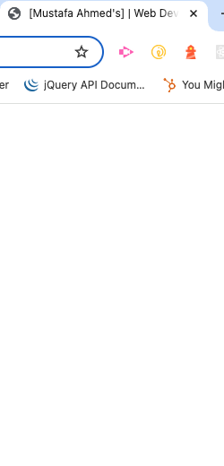

# mustafas-react-portfolio

## User-Story
As a hiring manager or recruiter looking for candidates with experience in building single-page applications,

I want to visit a candidate's deployed React portfolio,

So that I can evaluate their technical skills, design capabilities, and overall fit for a potential role.

Acceptance Criteria
When I load the candidate's portfolio,
Then I should see a clean, professional layout that includes a header, a main content section, and a footer.

When I view the header,
Then I should see the candidate's name prominently displayed, along with a navigation menu featuring links to sections titled "About Me," "Portfolio," "Contact," and "Resume."

When I look at the navigation menu,
Then I should see the title of the currently viewed section highlighted, and when I click on a different section title,
Then the page should scroll smoothly to that section, and the browser's URL should update accordingly.

When I first load the portfolio,
Then the "About Me" section should be selected and displayed by default.

When I view the "About Me" section,
Then I should see a recent photo or avatar of the candidate along with a brief bio that introduces them and their background.

When I navigate to the "Portfolio" section,
Then I should see six thumbnail images, each with a title and links to both the live application and its GitHub repository.

When I go to the "Contact" section,
Then I should see a form where I can enter my name, email address, and a message,
And When I attempt to leave a field empty or enter an invalid email address,
Then I should receive a notification alerting me to the error.

When I visit the "Resume" section,
Then I should see a link to download the candidate's resume and a list of their technical skills and proficiencies.

When I view the footer,
Then I should see icons or text links to the candidate's GitHub, LinkedIn, and one additional professional or social platform (such as Stack Overflow or Twitter).

## Mock-UP

## Live-App
8d666d03-350c-44c9-85cf-83d63fe33dd0
## GitHub-Repo
https://github.com/MustafaLH44/mustafas-react-portfolio